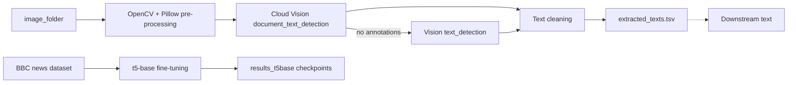

# Enhanced-OCR

> Batch OCR for scanned images with Google Cloud Vision, plus a `t5-base` fine-tuning script that learns to summarize the extracted text.

[](https://github.com/AkashNaickar/Enhanced-OCR/actions/workflows/ci.yml)
[](LICENSE)

There is **no hosted demo**. Both entry points are CLI/worker processes that need
Google Cloud credentials and, for summarization, a local PyTorch runtime — see
[Deployment](#deployment) for why nothing is deployed to a URL.

## Features

- Batch OCR over a folder of `.png/.jpg/.jpeg/.tiff/.tif/.bmp/.gif` images with
  Cloud Vision `document_text_detection`, falling back to `text_detection` when
  document detection returns no annotations.
- Optional OpenCV + Pillow pre-processing: Hough-line deskew, adaptive threshold,
  morphological open/close, contrast boost and sharpen. Falls back to the
  original image when the dependencies are missing or processing fails.
- Output cleaning that strips the Vision text blob and drops blank lines.
- Writes `filename`/`text` rows to TSV or CSV, choosing the delimiter from the
  output file extension.
- Fine-tunes `t5-base` on [`gopalkalpande/bbc-news-summary`](https://huggingface.co/datasets/gopalkalpande/bbc-news-summary)
  with ROUGE-1/2/L evaluation and mean generated length, then saves the model
  and tokenizer to the output directory.
- Pure helpers live in `enhanced_ocr/` and import with no Google Cloud or ML
  dependencies, so the test suite runs without credentials.

## Tech stack

| Layer | Tech |
|-------|------|
| OCR | Google Cloud Vision API (`google-cloud-vision`) |
| Image pre-processing | OpenCV, Pillow, NumPy |
| Summarization | PyTorch, Hugging Face Transformers, Datasets, Evaluate (`rouge-score`) |
| CLI | Python `argparse` |
| Tests / CI | pytest, Ruff, GitHub Actions |

## Architecture



## Quick start

> Verified from a clean clone: the test install, the test suite and the
> `--help` output of both CLIs (see [Testing](#testing)). The OCR and training
> runs below require a Google Cloud service account and the full runtime stack.

```bash
git clone https://github.com/AkashNaickar/Enhanced-OCR.git
cd Enhanced-OCR

python -m venv .venv
# Windows:
.venv\Scripts\activate
# macOS/Linux:
# source .venv/bin/activate

# Fastest path, no credentials needed:
pip install -r requirements-dev.txt
pytest
```

To actually run OCR, install the runtime stack, add a service-account key, drop
images into `image_folder/`, and run:

```bash
pip install -r requirements.txt

# put images in image_folder/ and export your key path:
# macOS/Linux:  export GOOGLE_APPLICATION_CREDENTIALS=/path/to/key.json
# PowerShell:   $env:GOOGLE_APPLICATION_CREDENTIALS="C:\path\to\key.json"

python gvisionReq.py --image-folder image_folder --output extracted_texts.tsv
```

To fine-tune the summarizer:

```bash
python t5transformer.py --epochs 1 --output-dir results_t5base
```

## Configuration

Copy `.env.example` to `.env` and set the values your shell needs. Nothing is
read from `.env` automatically; export the variables or use the CLI flags.

| Variable | Required | Description |
|----------|----------|-------------|
| `GOOGLE_APPLICATION_CREDENTIALS` | yes, for OCR | Path to the Google Cloud service-account JSON key. Falls back to `vision_ocr.json` in the repo root. |
| `VISION_SERVICE_ACCOUNT_FILE` | no | Alternative name for the same path; only used when `GOOGLE_APPLICATION_CREDENTIALS` is unset. |

`gvisionReq.py` flags: `--image-folder`, `--output`, `--no-preprocessing`, `--credentials`.
`t5transformer.py` flags: `--dataset`, `--model`, `--epochs`, `--batch-size`, `--output-dir`, `--max-length`.

The service-account key is gitignored (`.gitignore`) and must never be committed.

## Testing

```bash
pip install -r requirements-dev.txt
pytest
```

The suite (`tests/`) covers the pure helpers — image filtering, text cleaning,
length statistics and credential-path resolution — plus the Vision batch
pipeline driven by an injected fake client, and the T5 tokenization/metric
helpers. Google Cloud calls are not exercised; those need a real service
account.

## Deployment

Not deployed, by design. This is a CLI/worker, not a request/response service:

- `gvisionReq.py` needs a Google Cloud service account and reads/writes local
  image folders, so there is nothing to expose at a public URL.
- `t5transformer.py` is a long-running batch training job that expects a local
  PyTorch runtime (CPU or GPU); it is not a server.

Neither has a hosted endpoint, so no Vercel/Render deployment and no live demo
link are provided. Run them locally or on a scheduled worker with the
credentials mounted from the platform's secret store.

## Roadmap

- [ ] Add a `--recursive` option so nested image folders can be processed.
- [ ] Add an inference/CLI command that loads a saved checkpoint and summarizes a text file.
- [ ] Add a small OCR accuracy check against a labelled sample set.
- [ ] Support additional Vision language hints via a CLI flag.

## Contributing

Issues and PRs are welcome. Keep changes small and focused, run `pytest` and
`ruff check .` before opening a PR, and never commit credentials.

## License

MIT — see [LICENSE](LICENSE).
